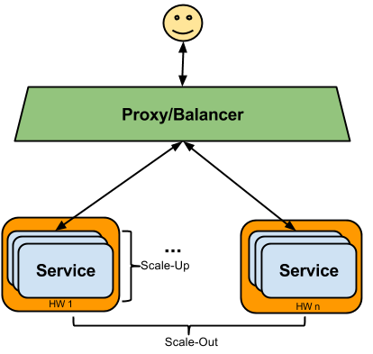
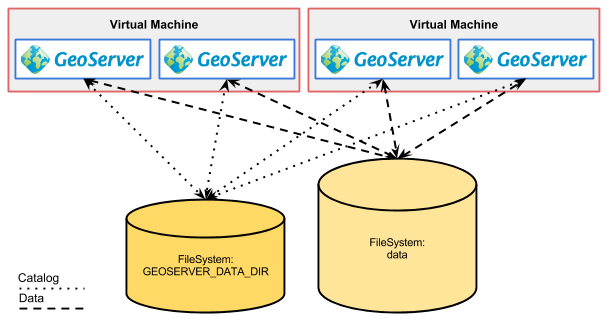
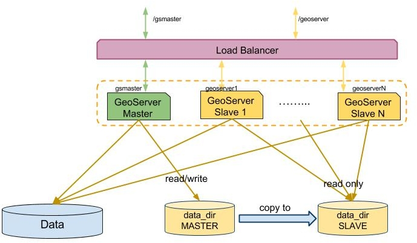
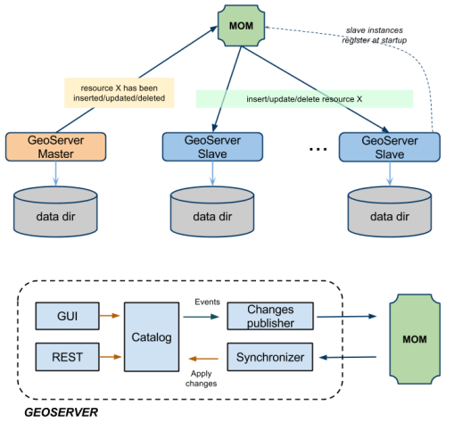
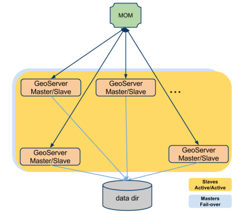
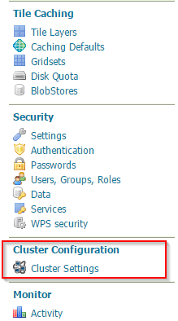

# GeoServer clustering con Docker

## Presentación rápida e instalación

Antes de empezar ir descargando las siguientes imágenes de docker:

- [oscarfonts/geoserver:2.15.0](https://hub.docker.com/r/oscarfonts/geoserver/) (~618MB)  -> `tomcat:9-jre11` -> `openjdk:11-jre` -> `buildpack-deps` -> `debian:stretch`
- [dockercloud/haproxy](https://hub.docker.com/r/dockercloud/haproxy)  (~42MB) -> `alpine:3.8`

```bash
docker pull oscarfonts/geoserver:2.15.0
docker pull dockercloud/haproxy
```

Y el taller en sí:

```bash
git clone https://github.com/groldan/2019_foss4g-ar_taller_geoserver taller_geoserver
cd taller_geoserver
```

Y por las dudas asegurarse de tener `docker-compose`:

```
sudo apt-get install docker-compose
```

Finalmente, ejecutar los siguientes comandos:

```
cd docker/broker_externo
docker-compose build
```

## Clustering en GeoServer

Clustering es un sistema de procesamiento paralelo o distribuido donde participan computadoras independientes (o máquinas virtuales, contenedores docker, etc).

En GeoServer se puede aplicar para lograr una configuración de **alta disponibilidad** o para lograr una **mayor escalabilidad**. Independientemente de la razón, existen algunas limitaciones que deben tenerse en cuenta y, cuando sea posible, se deben solucionar.

En la parte restante de esta sección, proporcionaremos información para obtener una comprensión básica de la agrupación en clúster, luego analizaremos las diversas posibilidades para agrupar GeoServer, utilizando docker y docker-compose para definir las características del cluster.

## Introducción al Clustering y Alta Disponibilidad.

Las técnicas de clustering se utilizan para mejorar el rendimiento y la disponibilidad de un sistema complejo. En términos generales, un clúster está pensado como un conjunto redundante de servicios que proporciona el mismo conjunto de funcionalidades.

La calidad del cluster se puede medir por:

**Fiabilidad** la capacidad de proporcionar respuestas con éxito en cada solicitud entrante.
**Disponibilidad** del tiempo de actividad del servidor (generalmente medido como% del tiempo de actividad anual)
**Rendimiento** medido por el promedio del tiempo empleado por el servicio para proporcionar respuestas o por el rendimiento
**Escalabilidad**, es la capacidad de manejar una cantidad creciente de trabajo de una manera eficiente sin degradación en la calidad del servicio

### Alta disponibilidad
Los clústeres de alta disponibilidad (HA) son grupos de servicios que pueden utilizarse de manera confiable con un tiempo de inactividad mínimo (o nulo). Sin la agrupación en clústeres, si un servicio falla o está demasiado ocupado, el usuario que solicita ese servicio nunca recibirá una respuesta rápida. La agrupación de alta disponibilidad debe diseñarse para remediar esta situación al detectar un servicio inactivo (mediante un perro guardián) y reiniciarlo inmediatamente. Durante esta operación, el servicio será proporcionado por una instancia de conmutación por error del mismo servicio.

### Escalabilidad

"Escalar" un sistema generalmente significa agregar más instancias del producto. Podemos distinguir dos formas diferentes de escalar:

**La escalabilidad horizontal** también se conoce como escalamiento horizontal (scale out), que se puede realizar agregando recursos HW adicionales al grupo existente. En nuestro contexto, esto significa agregar más máquinas físicas o virtuales con GeoServer instalado.

**La escalabilidad vertical** (scale up) se puede realizar al obtener hardware más potente (más CPU / memoria), y que normalmente se debe combinar agregando más instancias de software también en el mismo servidor (en la práctica no esiste software 100% linealmente escalable). En nuestro contexto, esto significa instalar más instancias de GeoServer en el HW existente para utilizar completamente los recursos disponibles, en particular las CPU adicionales.

 


## Configuración pasiva de alta disponibilidad (HA) para GeoServer

Requiere la agrupación de isntancias de GeoServer para implementar una configuración de alta disponibilidad, así como para lograr una escalabilidad superior.

 

Este tipo de configuración acarrea una serie de problemas, y sólo es factible para un servicio estático. Es decir, una vez confiurado, se asume de sólo lectura en cuanto a la configuración del catálogo. De lo contrasio la falta de comunicación entre las instancias resulta en un desastre.


## Backoffice / configuración de producción (directorio de datos separado)

Cuando se configura un clúster de GeoServer con directorio de datos compartidos, se recomienda configurar un GeoServer fuera de línea que trabaje con una copia del directorio de datos de clúster (área de preparación), realizar cambios hasta que se alcance un nuevo diseño de configuración satisfactorio y luego propagar los cambios al clúster de producción con los siguientes pasos:

* Copiar el directorio de datos (de configuración) del área de preparación al de producción.
* Ejecutar el **comando de configuración REST "recargar" en cada nodo** (!!) del clúster para que la nueva configuración se cargue en el disco.

Este enfoque comienza a mostrar sus limitaciones cuando se aplica cualquiera de las siguientes situaciones:

* Cambios frecuentes de configuración que deben aplicarse de inmediato a todo el clúster
* La configuración contiene muchas capas de datos (cientos o más) lo que implica un tiempo de recarga largo. Durante la fase de recarga, el servidor no puede responder correctamente a las solicitudes de OGC ya que la configuración se encuentra en un estado incoherente e incompleto.

 

## GeoServer Active Clustering

> Nota
En esta sección, y también en la siguiente, asumimos que está familiarizado con el concepto de GeoServer Data Directory

Como hemos visto en secciones anteriores, existen varios enfoques para implementar un clúster con GeoServer basado en diferentes opciones para compartir / sincronizar directorios de datos y recargar la configuración. Sin embargo, estas técnicas tienen limitaciones intrínsecas en cuanto a la escalabilidad con respecto al número de capas, por lo que decidimos crear una **Extensión de clustering** de GeoServer específica para superarlas.

Hemos implementado una extensión **Multi Master** para GeoServer que aprovecha un **Message Oriented Middleware** (MOM) para mantener todos los nodos del clúster sincronizados con respecto a sus configuraciones.

* Las instancias Maestras aceptan cambios en la configuración interna, los conservan en su propio directorio de datos y los envían a los Esclavos a través del MOM (con entrega garantizada)
* Las instancias esclavas no deben usarse para cambiar la configuración desde REST o desde la Interfaz del usuario, ya que están configurados para recibir e inyectar (directamente en la memoria) los cambios de configuración difundidos por el Maestro(s) a través del MOM
* El MOM se usa detrás de escena para hacer que los Maestros y los Esclavos intercambien mensajes que contienen cambios en la configuración. A veces vamos a usar el término *Broker* como sinónimo de MOM

Cada esclavo puede configurarse para tener su propio directorio de datos (privado), en este caso se configurará para usar una suscripción duradera al MOM para mantener su directorio de datos sincronizado con el del Maestro, de modo que cuando se realice un cambio de configuración de un Maestro. (A través de la MOM) se recibe también se persistirá. Con esta configuración, en caso de que un esclavo se apague cuando vuelva a subir, recibirá una serie de cambios de configuración para alinear su directorio de datos con el del Maestro. En la siguiente ilustración, se muestra esta configuración (con un solo maestro: enfoque de varios esclavos).

 
*Ilustración: Maestro único: grupo de esclavos múltiples con directorios de datos privados y MOM externa*


Una configuración similar es útil en los casos en que es posible compartir el directorio de datos en múltiples instancias (por ejemplo, escalar o escalar verticalmente en una sola instancia grande, pero incluso escalar mientras todavía se tiene disponible un sistema de archivos compartido / agrupado). Vale la pena mencionar que, si bien los cambios en la configuración a través de la interfaz de usuario o la interfaz REST deben dirigirse tanto como sea posible al mismo Maestro (por lo tanto, recomendamos configurarlos en "failover" o Activo/Pasivo). Sin embargo, es posible configurar todas las instancias en Activo / Activo cuando se trata de responder consultas OGC.

Vale la pena señalar que con la extensión de agrupación activa de GeoServer, un nodo puede ser maestro y esclavo al mismo tiempo, lo que permite una configuración "peer to peer". En términos generales, todos los nodos pueden ser Maestro y Esclavo al mismo tiempo, sin embargo, como se mencionó anteriormente, sería bueno configurar el load-balancer para usar un conmutador en modo "failover" para cambios de configuración (GUI o REST) ​​en caso que se esperen cambios frecuentes en la configuración (más sobre esto más adelante). 

En la siguiente ilustración, se muestra una configuración con un diseño P2P y un directorio de datos compartidos.


 
*Ilustración: P2P y directorio de datos compartidos.*

> Hasta aquí la teoría. Todo el crédito para [GeoSolutions](https://www.geo-solutions.it/) por la [documentación](https://geoserver.geo-solutions.it/edu/en/clustering/) e implementación.


## Ejercicios

Todo lo dicho hasta aquí tal vez suene un poco complicado, cuando en realidad, con las herramientas adecuadas no tiene por qué serlo.
Utilizando `docker` y `docker-compose`, podemos crear diferentes topologías de clusters para geoserver con relativa facilidad, gracias a las extensiones anteriormente mencionadas.

> Nota: Es hora de migrar a Java 11. GeoServer 2.15.0 puede correr en una JVM 11.
OpenJdk 11 viene con soporte para containers (es decir, respeta los límites uso de recursos de CPU y memoria RAM establecidos para el container, mientras que las últimas versiones de Java 8 sólo respetan los límites de memoria).
Con esto, se pueden correr varios containers en una misma máquina física controlando los recursos que cada container debe respetar, evitando el sobredimensionamiento de las instancias y agotar los recursos del host innecesariamente.

Para empezar, vamos a probar un contenedor con geoserver listo para usar, abriendo una terminal y ejecutando:

```bash
docker run -it -p 8080:8080 oscarfonts/geoserver --name geoserver
```

> `-it` nos permitirá "apagar" el contenedor con CTRL-C
`-p 8080:8080 ` expondrá el puerto TCP 8080 del contenedor como el puerto 8080 del host (`-p <host port>:<container port>`).

Una vez hecho esto podemos acceder a GeoServer a través de http://localhost:8080/geoserver usando el clásico usuario `admin` y password `geoserver`. No nos vamos a detener en la típica configuración de master password y demás medidas de seguridad. Nuestro objetivo es aprender a configurar un cluster de geoservers con docker.

Al darle un nombre al contenedor (`--name geoserver`), podremos referirnos a esa instancia a través de ese nombre al utilizar otros comandos. Por ejemplo:

```bash
$ docker exec -it geoserver /bin/bash
root@acfa10cc36da:/usr/local/tomcat# apt-get update && apt-get install procps
root@acfa10cc36da:/usr/local/tomcat# ps axuf
USER        PID %CPU %MEM    VSZ   RSS TTY      STAT START   TIME COMMAND
root        524  0.0  0.0  19968  3608 pts/1    Ss   13:49   0:00 /bin/bash
root        530  0.0  0.0  38388  3164 pts/1    R+   13:49   0:00  \_ ps axuf
root          1  0.0  0.0   4292   752 pts/0    Ss+  13:40   0:00 /bin/sh -c start.sh
root          6  0.0  0.0  19724  3228 pts/0    S+   13:40   0:00 /bin/bash /usr/local/bin/start.sh
root          8 14.8  0.4 9713484 623864 pts/0  Sl+  13:40   1:16  \_ /docker-java-home/bin/java -Djava.util.log ...
```

> `docker run` cheatsheet:
`-i, --interactive`: Mantener STDIN abierto (permite terminar el container con CTRL-C combinato con `-t`)
`-t, --tty`:  Asignar pseudo-TTY (permite terminar el container con CTRL-C combinato con `-i`)
`-d, --detach`: Run container in background and print container ID
`-v, --volume <list>`: Bind mount a volume. **Path absoluto**
`-p, --publish <list>`: Publish a container's port(s) to the host
`--name string`: Assign a name to the container
`--cpus decimal`: Number of CPUs
`--user uid:gid`: Ejecutar container como el ususario y grupo especificado. Por defecto: `root`


Cabe destacar que las imágenes de docker son immutables. Cada cambio que se realice en el sistema de archivos del contenedor (instancia de una imagen), se pierde cuando la imagen se apaga. Por tanto, se utilizan "volumenes" y directorios del host (máquina que ejecuta el contenedor) para "montalos" en los directorios del contenedor que sea necesario.

### Externalización de la configuración y extensiones

Esta imagen docker para geoserver permite montar el directorio de configuración de geoserver (variable de entorno `GEOSERVER_DATA_DIR`) así como instalar fácilmente extensiones, mediante "mount points", o sea, asignar directorios locales (del host) a directorios del contenedor.

GeoServer se encuentra preparado para cargar su configuración desde `/var/local/geoserver` y las extensiones desde `/var/local/geoserver-exts`. El mapeo de directorios locales a directorios del contenedor se realiza mediante el parámetro `-v` de `docker run`, por ejemplo: 

```bash
docker run -v /path/to/local/data_dir:/var/local/geoserver -v /path/to/local/exts_dir:/var/local/geoserver-exts/
```
Donde ambos paths deben ser absolutos.

### Data Directory externo

```bash
docker rm geoserver
docker run -it -p 8080:8080 -v $(pwd)/datadir:/var/local/geoserver --name=geoserver oscarfonts/geoserver
```
> debemos remover el contenedor `geoserver` anterior pues hemos cambiado la configuración de ejecución.

Accedemos a GeoServer a través de http://localhost:8080/geoserver y verificamos que los stores y capas que vienen pre instalados ya no están.
Probamos crear un DataStore de tipo GeoPackage con el archivo que debería encontrarse en en data directory llamado `ign.gpkg`.
Damos de baja el contenedor (CTRL-C) y lo lamzamos de nuevo, verificamos que la configuración aún está ahí, pues estamos "mapeando" el directorio local al directorio de datos del contenedor.

#### Configurar extensiones:

Para agregar extensiones, hay que proveer un directorio por extensión con su contenido descomprimido dentro del directorio local para las extensiones:

```bash
unzip plugins/geoserver-2.15.0-vectortiles-plugin.zip -d extensiones/vectortiles
```

Y lanzar el contenedor montando `extensiones/` en `/var/local/geoserver-exts`:

```bash
docker rm geoserver
docker run -it -p 8080:8080 -v $(pwd)/extensiones:/var/local/geoserver-exts/ -v $(pwd)/datadir:/var/local/geoserver --name=geoserver oscarfonts/geoserver
```
> Nuevamente debemos remover el contenedor `geoserver` anterior pues hemos cambiado la configuración de ejecución.


### Instalar Active Clustering

Bien, ahora vamos a instalar la extensión que permite configurar un clúster activo:

```bash
docker rm geoserver
unzip -d extensiones/activeclustering plugins/geoserver-2.15-SNAPSHOT-jms-cluster-plugin.zip
docker run -it -p 8080:8080 -v $(pwd)/extensiones:/var/local/geoserver-exts/ -v $(pwd)/datadir:/var/local/geoserver --name=geoserver oscarfonts/geoserver
```
Vamos a http://localhost:8080/geoserver. En el panel izquierdo de la UI debería encontrarse un nuevo ítem: "Cluster configuration":

 

## Configurar cluster con docker-compose

`docker-compose` es una herramienta que utiliza un archivo `docker-compose.yml` para definir la topología de un grupo de contenedores y administrarlos.
Ésta configuración se extiende más allá de ejecutar varios contenedores en la misma máquina, para lo cual existen diversas herramientas que permiten crear verdaderos enjambres de servicios mediante conenedores docker. Entre ellas se encuentran [docker swarm](https://docs.docker.com/engine/swarm/), [Kubernetes](https://kubernetes.io/), [Rancher](https://rancher.com/) y otras.

### Contenedor para el Message Oriented Middleware

GeoSolutions ha creado una aplicación web separada de GeoServer que se distribuye como un archivo .war.
Con éste, primero vamos a crear una imagen docker para poder desplegarlo como un broker de mensajes independiente, en lugar de que cada instancia de geoserver contenga un broker embebido.

Dentro de `taller_geoserver/docker/broker` se encuentra el `Dockerfile`. La imagen ya la generamos al iniciar el taller, de lo contrario es tiempo de hacerlo:

```
cd docker/broker_externo
docker-compose build
```
Este contenedor utiliza como base la misma imagen de tomcat que la de geoserver, pero ejecuta el broker basado en [ActiveMQ](http://activemq.apache.org/), y expone el puerto TCP `61666` para que las instancias de geoserver desde otros contenedores se conecten.

### Cluster master-slave

Examinar el archivo `docker/broker_externo/docker-compose.yml`
Y los archivos `cluster.properties` y `embedded-broker.properties` en `datadir/cluster/master` y `datadir/cluster/slave`.

Las propiedades más importantes son:
- `activemq.transportConnectors.server.uri=tcp://broker:61666?....`
- `brokerURL=tcp://broker:61666`

### Cluster escalable

La topología anterior nos permite definir las instancias una por una. Pero qué sucede si se quiere poder escalar (tanto hacia arriba como hacia abajo) la cantidad de instancias. Por ejemplo, para atender picos de demanda y luego volver a la normalidad, sin hacer sobreprovisionamiento de recursos todo el tiempo.

Veamos la configuración de `docker/broker_externo_scale`.

Ahora podemos disponer de tantas instancias como sean necesarias sin necesidad de cambiar ninguna configuración.
El provisionamiento de las mismas en diferentes servidores físicos o virtuales queda a cargo de las herramientas a tal efecto antes mencionadas, que escapan al objetivo del taller, y por ahora al conocimiento de quien les habla :).

